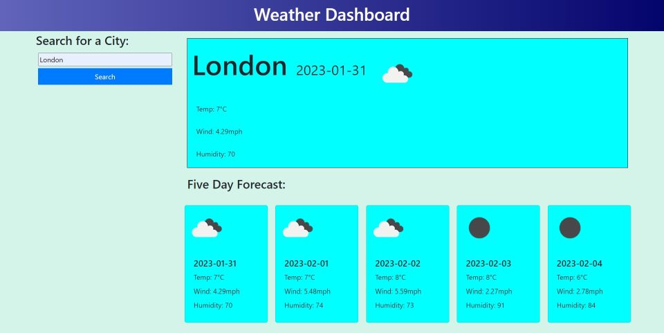

# Weather-Application

I coded the majority of the app without using any Google resources, so there is probably more code than there needs to be. I'm hoping I can improve this aspect of my programming in time when I have more time to actually study refactoring code. The process was fairly straightforward - understanding the returned search objects is very logical. Although getting the search function to work took some time. 

All the information printed to the page is contained in the objects returned by the API request, including the code for the weather icons, which is where I'm a bit stuck at the moment. In the large box all the information appears, but not the weather icon, no matter what I do. It's very confusing because the exact same code runs perfectly in the first of the five Bootstrap cards at the bottom of the page. When I comment out the HTML belonging to the first Bootstrap card, the icon appears in the top box. Now trying to find out the problem. Work is ongoing.

<https://bertiemoogle.github.io/Weather-Application/>